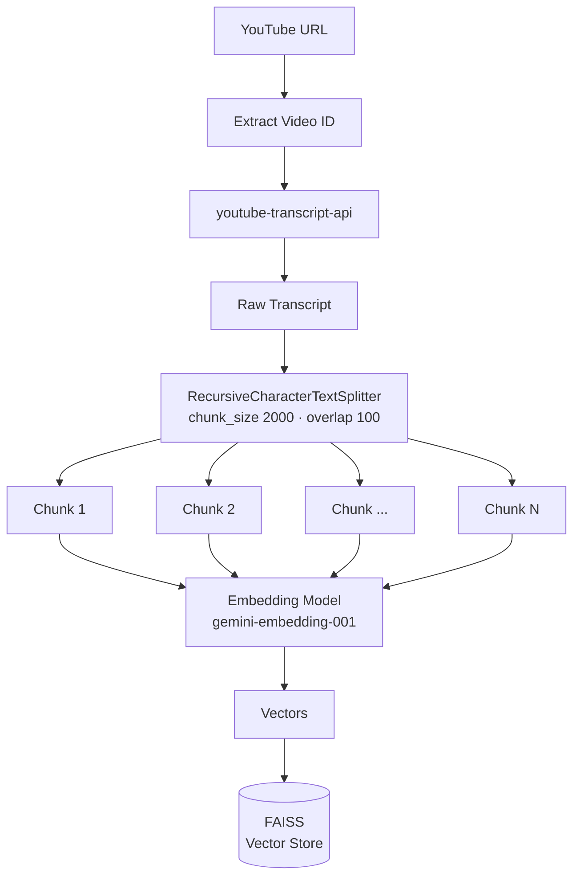
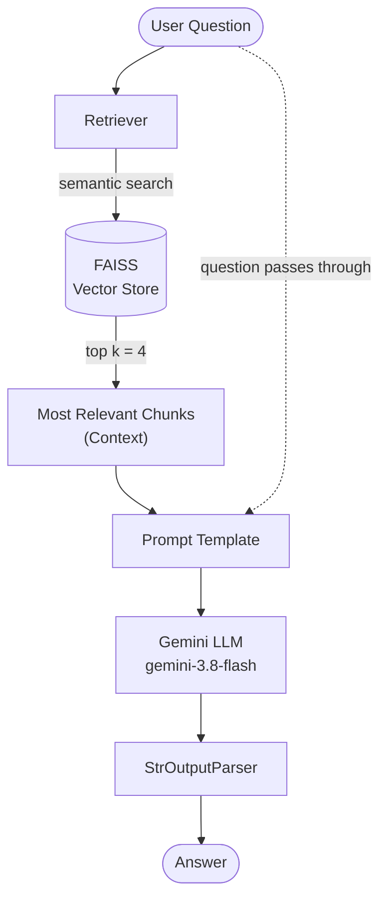

# 🎥 YouTube Chatbot

Chat with any YouTube video. Paste a URL, and the app pulls the video's
transcript, indexes it, and answers your questions using **only** what was
actually said in that video.

Built with LangChain, Google Gemini, FAISS and Streamlit.

---

## How it works

This is a **RAG** (Retrieval-Augmented Generation) pipeline. The LLM has never
seen the video you just pasted, so instead of asking it to recall anything, we
fetch the transcript, store it in a searchable form, and hand the model only the
passages relevant to each question.

The system runs in two phases: **indexing** happens once per video, **retrieval
and generation** happens once per question.

### Phase 1 - Indexing

Turning a video into a searchable vector store. This runs when you click
*Process Video*.



| Step | What happens | Function |
|---|---|---|
| **Transcript** | Fetch captions, flatten to plain text | `fetch_transcript()` |
| **Text Splitter** | Cut into 2000-char chunks with 100-char overlap | `split_transcript()` |
| **Embedding Model** | Each chunk becomes a vector | `build_vector_store()` |
| **Vector Store** | Vectors indexed in FAISS for similarity search | `build_vector_store()` |

Chunking matters because a full transcript is far too long to fit in a prompt,
and because smaller passages give sharper retrieval.

> Transcripts are fetched with `youtube-transcript-api` rather than LangChain's
> built-in YouTube loader, which is unreliable.

### Phase 2 - Retrieval and generation

What happens each time you ask a question.



The question is embedded and compared against every chunk vector. The closest
**4** chunks become the context. Notice the question travels **two paths at
once**: into the retriever to find context, and straight through to the prompt
as the question itself.

### The same flow, in code

That two-path structure is expressed as a `RunnableParallel`:

```python
parallel_chain = RunnableParallel({
    "context": retriever | RunnableLambda(format_docs),
    "question": RunnablePassthrough(),
})

chain = parallel_chain | prompt | llm | StrOutputParser()
```

`RunnablePassthrough` is what lets the raw question survive alongside the
retrieved context, and `StrOutputParser` turns the model's `AIMessage` into a
plain string.

---

## Project structure

```
UTubeChatbot/
├── backend/
│   ├── pipeline.py        # the RAG pipeline: transcript → chunks → FAISS → chain
│   └── youtube_utils.py   # YouTube URL → video ID extraction and validation
├── frontend/
│   └── app.py             # Streamlit UI (state and rendering only)
├── chatbot.ipynb          # the original notebook the pipeline was built in
├── requirements.txt
└── .env                   # your API key (never committed)
```

`frontend/app.py` holds no pipeline logic — it imports everything from
`backend/`, so the UI and the RAG chain stay independent.

---

## Setup

**1. Install dependencies**

```bash
pip install -r requirements.txt
```

**2. Add your Gemini API key**

Create a `.env` file in the project root:

```
GOOGLE_API_KEY=your_key_here
```

Get a key from [Google AI Studio](https://aistudio.google.com/app/apikey).
The key is read via `python-dotenv` and never reaches the frontend.

**3. Run the app**

```bash
streamlit run frontend/app.py
```

Then open http://localhost:8501.

---

## Usage

1. Paste a YouTube URL and click **Process Video**
2. Wait for indexing — the status panel shows each stage
3. Ask questions in the chat box
4. **Load Another Video** clears the video, index and chat history

### Supported URL formats

| Format | Example |
|---|---|
| Standard | `youtube.com/watch?v=VIDEO_ID` |
| With playlist | `youtube.com/watch?v=VIDEO_ID&list=...&index=12` |
| Short link | `youtu.be/VIDEO_ID` |
| Shorts | `youtube.com/shorts/VIDEO_ID` |
| Embed / live | `youtube.com/embed/VIDEO_ID`, `youtube.com/live/VIDEO_ID` |

Extra query parameters are ignored — only the 11-character video ID is used.

---

## Configuration

All tunable settings live at the top of `backend/pipeline.py`:

```python
CHUNK_SIZE = 2000        # characters per chunk
CHUNK_OVERLAP = 100      # overlap between neighbouring chunks
EMBEDDING_MODEL = "gemini-embedding-001"
CHAT_MODEL = "gemini-3.8-flash"
RETRIEVER_K = 4          # chunks retrieved per question
```

If an answer misses something you know is in the video, `CHUNK_SIZE` and
`RETRIEVER_K` are the first two dials to turn.

---

## Known limitations

**The video must have captions.** No transcript means no chatbot — the app says
so clearly rather than failing silently.

**Embeddings are rebuilt on every Process Video.** The index lives in session
state, not on disk, so restarting Streamlit means re-embedding. A ~45 minute
video is around 71 chunks, and Gemini's free tier allows 100 embedding requests
per minute, so processing several videos in quick succession can hit the quota.

**No conversational memory.** Each question is answered independently; the chain
does not see earlier turns, so follow-ups like *"what about the second one?"*
will not resolve.

**Answers are transcript-only by design.** If the retrieved context does not
cover your question, the model says it does not know rather than guessing.

---

## Tech stack

| Component | Choice |
|---|---|
| LLM | Google Gemini (`gemini-3.8-flash`) |
| Embeddings | `gemini-embedding-001` |
| Vector store | FAISS (in-memory) |
| Orchestration | LangChain (LCEL) |
| Transcripts | `youtube-transcript-api` |
| Frontend | Streamlit |
"# Youtube_chatbot" 
